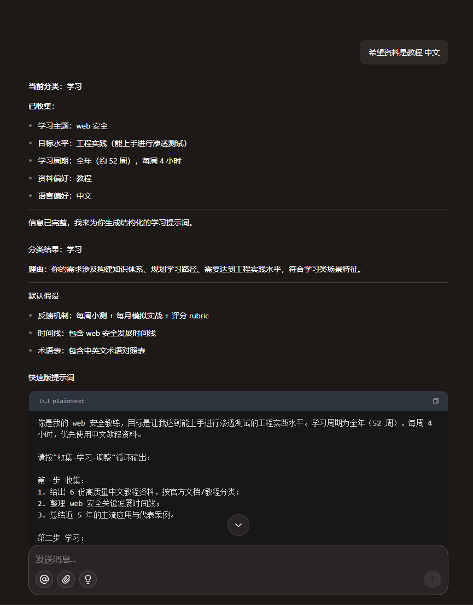

# 提问.SKILL

`提问.SKILL` 用于把用户问题自动分流为三类：`咨询`、`学习`、`开发`，并通过**单字段逐步引导**帮助用户生成准确、简明、高质量的提示词。

## 在线使用

这个 SKILL 已在扣子上线，可直接使用：  
[https://www.coze.cn/?from=coze_program&skills=7625850688832323603](https://www.coze.cn/?from=coze_program&skills=7625850688832323603)

